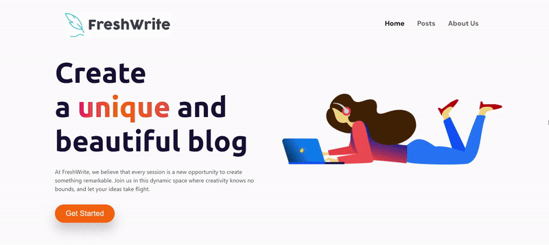

# FreshWrite: Blog WebApp Using EJS



### Project Setup

1. **Clone the Repository**
   ```
   git clone https://github.com/SahilTyagii/FreshWrite.git
   ```
2. **Install Dependencies**
   ```
   npm i
   ```
3. **Start Development Server**
   ```
   nodemon server.js
   ```
